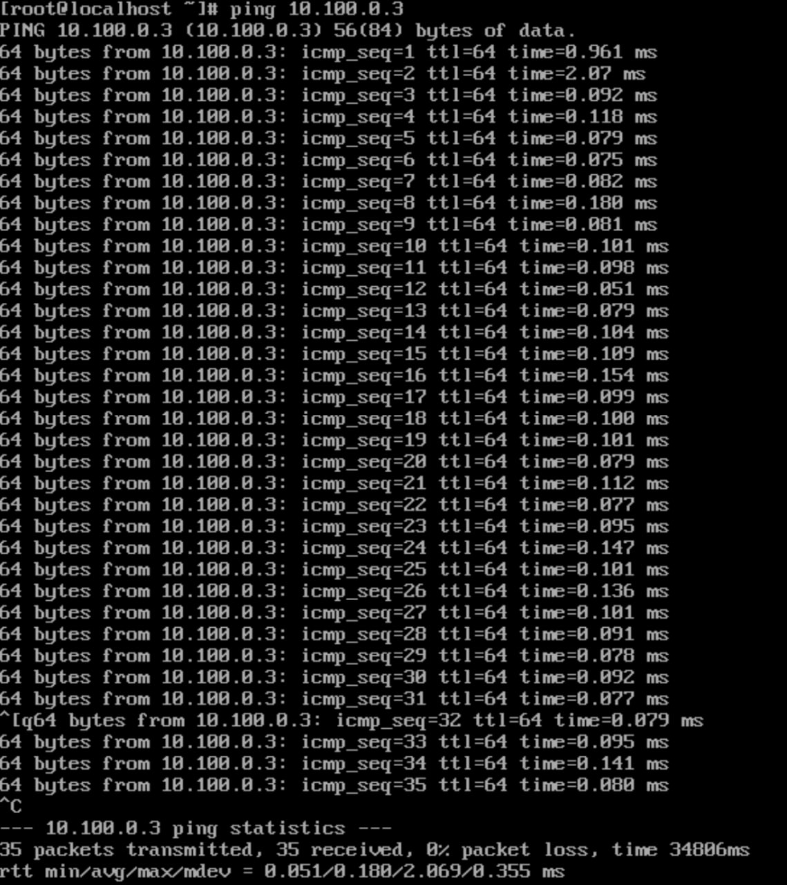
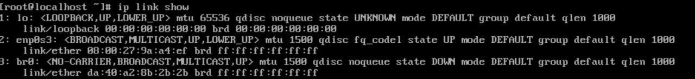
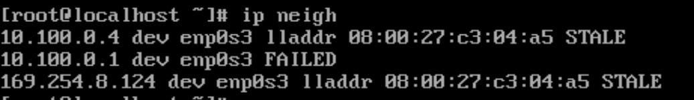

# Лабораторная Работа 1
*де Джофрой Мишель, Белунин Дмитрий Вадимович, Кирдин Даниил Игоревич*

## Часть 1. Linux (Debian 11)

```bash
#!/bin/bash

show_network_card_info() {
    printf "\n"
    echo "Network Card Information"
    echo "------------------------"

    # Get the first active interface with an IP address
    iface=$(ip -o -4 addr list | awk '{print $2}' | head -n 1)

    if [ -z "$iface" ]; then
        echo "No active network interface found!"
        return
    fi

    echo "Interface: $iface"

    ip addr show $iface | grep -E "inet |ether"

    printf "\n"

    lshw_output=$(lshw -class network | grep -A 15 "$iface")

    model=$(echo "$lshw_output" | grep "product:" | awk -F ': ' '{print $2}')
    duplex=$(echo "$lshw_output" | grep -oP '(?<=duplex=)[^ ]+')
    speed=$(echo "$lshw_output" | grep -oP '(?<=speed=)[^ ]+')
    link=$(echo "$lshw_output" | grep -oP '(?<=link=)[^ ]+')

    echo "Model: $model"
    echo "Duplex: $duplex"
    echo "Speed: $speed"
    echo "Link: $link"
}

show_ipv4_config() {
    printf "\n"
    echo "IPv4 Configuration"
    echo "------------------"

    iface=$(ifconfig | grep -o '^[^ ]*' | head -n 1)

    if [ -z "$iface" ]; then
        echo "No active network interface found!"
        return
    fi

    ifconfig $iface | grep 'inet ' | awk '{print "IP Address: " $2 "\nNetmask: " $4}'

    route -n | grep 'UG[ \t]' | awk '{print "Gateway: " $2}'

    grep "nameserver" /etc/resolv.conf | awk '{print "DNS: " $2}'
}

configure_scenario_1() {
    printf "\n"
    echo "Configuring network for static IP (Scenario #1)"
    
    iface=$(ifconfig | grep -o '^[^ ]*' | head -n 1)

    if [ -z "$iface" ]; then
        echo "No active network interface found!"
        return
    fi

    ifconfig $iface 10.100.0.2 netmask 255.255.255.0 up

    route add default gw 10.100.0.1

    echo "nameserver 8.8.8.8" | tee /etc/resolv.conf > /dev/null

    echo "Static network configuration applied for Scenario #1"
}

configure_scenario_2() {
    printf "\n"
    echo "Configuring network for dynamic IP (Scenario #2)"
    
    iface=$(ifconfig | grep -o '^[^ ]*' | head -n 1)

    if [ -z "$iface" ]; then
        echo "No active network interface found!"
        return
    fi

    ifconfig $iface down
    ifconfig $iface up
    dhclient $iface

    echo "Dynamic network configuration (DHCP) applied for Scenario #2"
}

# Menu template
while true; do
    echo ""
    echo "Select an option:"
    echo "1. Show network card details"
    echo "2. Show current IPv4 configuration"
    echo "3. Configure network (Scenario #1)"
    echo "4. Configure network (Scenario #2)"
    echo "5. Exit"
    echo ""
    
    read -p "Enter your choice: " choice
    
    case $choice in
        1)
            show_network_card_info
            ;;
        2)
            show_ipv4_config
            ;;
        3)
            configure_scenario_1
            ;;
        4)
            configure_scenario_2
            ;;
        5)
            echo "Exiting..."
            exit 0
            ;;
        *)
            echo "Invalid choice. Please try again."
            ;;
    esac
done
```

## Часть 2. Работа с виртуальными интерфейсами Linux CentOS через Network Manager
Сценарии, используемые в работе:
- _Статическая_ адресация `IP`=10.100.0.2, `MASK`=255.255.255.0, `GATE`=10.100.0.1, `DNS` = 8.8.8.8
- _Динамическая_ – все параметры получаются автоматически с `dhcp` сервера.

1. Настроили режим работы внутренняя сеть в Virual Box:


2. Настроили сетевой интерфейс с именем `enp0s3` по сценарию 1
``` bash
nmcli connection add
type ethernet 
con-name static-connection
ifname enp0s3
ipv4.address 10.100.0.2/24 
ipv4.gateway 10.100.0.1 
ipv4.dns 8.8.8.8
ipv4.method manual
```

Активировали по команде
```
nmcli connection up static-connection
```


(Что значит enp0s3:)
_enp0s3: The network interface name as a string. The "en" stands for ethernet, "p0" is the bus number of the ethernet card, and "s3" is the slot number._
3. Создали виртуальный сетевой интерфейс с именем `br0`
``` bash
nmcli connection add 
type dummy 
con-name br0 
ifname br0
ipv4.address 10.100.0.3/24 
ipv4.method manual
```
(Что значит dummy interface:)
_As a Red Hat Enterprise Linux user, you can create and use dummy network interfaces for debugging and testing purposes. A dummy interface provides a device to route packets without actually transmitting them. It enables you to create additional loopback-like devices managed by NetworkManager and makes an inactive SLIP (Serial Line Internet Protocol) address look like a real address for local programs._

4. Активировали сетевой интерфейс по команде
``` bash
nmcli connection up br0
```

5. С помощью команды ping проверили связь между реальным и виртуальным сетевым интерфейсом

(Что значит проверить связь реального и виртуального сетевого интерфейса в контексте этой лабы):
В скриншоте где мы добавляли enp0s3 девайс, мы в тот момент находились относительно его айпи адреса. Соответсвенно когда мы пинговали адрес 10.100.0.3 - мы из реального девайса пинговали виртуальный (пакеты проходили - значит связь есть)

6. С помощью команды `ip link show` узнали MAC-адрес виртуального интерфейса


## Часть 3.
1. Добавили YAML файл 01-network-manager-all.yaml в директорию /etc/netplan
Содержимое файла:
``` yaml
network:
  version: 2
  ethernets:
    enp0s3:
      addresses:
        - 10.100.0.4/24
        - 10.100.0.5/24
      routes:
        - to: 0.0.0.0/0
          via: 10.100.0.3
```

Применили конфигурацию по команде `netplan apply`

2. Проверили связь ip адресов 10.100.0.2-10.100.0.5


3. Выводим arp кэш по команде `ip neigh`


## Часть 4. Настройка объединения реальных сетевых интерфейсов в Linux

## QA
С помощью утилиты `ip`:
1. _назначить новый IPv4 адрес_: 
`ip addr add xx.xxx.x.x/yy dev enp0s3`
2. _назначить новый MAC адрес_: Сначала нужно временно остановить устройство, затем назначить новый MAC-адрес и потом снова поднять
``` bash
sudo ip link set dev wlan1 down
sudo ip link set dev wlan1 address 12:e1:7d:f8:a3:e5
sudo ip link set dev wlan1 up
```
3. _назначить новый gateway_: 
Сначала удаяем текущий, затем добавляем новый
``` bash
route del default
sudo route delete default gw IP-Address Adapter
sudo route add default gw IP-Address Adapter
```

В случае, если несколько дефолтных gateway:
```bash
sudo route delete default gw IP-Address Adapter
```

4. _вывести информацию arp кэше_: 
`ip neigh`
5. _очистить arp кэш_: 
`ip -s -s neigh flush all`
Двойной флаг `-s` означает удаление и ARP и NDISC кэша
6. _включить интерфейс_: 
`nmcli connection up DEVICE_NAME`
7. _выключить интерфейс_: 
`nmcli connection down DEVICE_NAME`
8. _Как с помощью nmcli назначить на интерфейс статический IP адрес, маску и настроить default gateway_:
9. _Как с помощью netplan назначить на интерфейс статический IP адрес,
маску и настроить default gateway_: 
`nmcli con add type ethernet ifname enp0s3 con-name CONNECTION_NAME ip4 192.168.1.100/24 gw4 192.168.1.1`
10. _Какие режимы bonding стандартно существую в Linux? Опишите их назначение, возможности по отказоустойчивости и необходимость поддержки со стороны оборудования_: Обеспечение отказоустойчивости и увеличение пропускной способности в результате объединения сетевых интерфейсов и передачи/принятия пакетов по определённым стратегиям - либо “по кругу”,
при отказе 1 узла остальные продолжают функционировать, либо один работает, остальные просто на за замену (резервные), либо трафик идёт на все подряд - broadcast (теряем смысл увел пропускной способности), либо трафик распределяется по кэшу относительно мак адресов устройств.
11. _Какие существуют и чем отличаются режимы работы адаптера (duplex)_:
**Full-duplex mode** (full). Interfaces operating in this mode can send and receive packets simultaneously.
**Half-duplex mode** (half). Interfaces operating in this mode cannot send and receive simultaneously.
**Auto-negotiation mode** (auto). Interfaces operating in this mode negotiate a duplex mode with their peers.
12. _Какой, по-вашему, практический смысл в возможности назначения нескольких IP адресов на один интерфейс_:
Для того, чтобы сервер мог принимать запросы от нескольких приложений
13. _Какой, по-вашему, практический смысл в возможности создания
виртуальных интерфейсов?_:
As a Red Hat Enterprise Linux user, you can create and use dummy network interfaces for debugging 
and testing purposes. A dummy interface provides a device to route packets without actually 
transmitting them. It enables you to create additional loopback-like devices managed by NetworkManager 
and makes an inactive SLIP (Serial Line Internet Protocol) address look like a real address for local programs.
